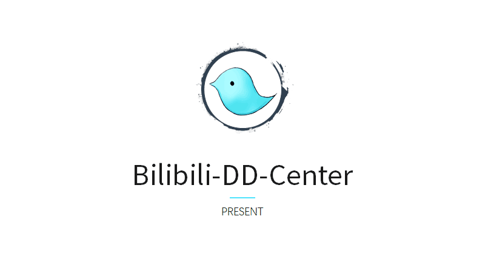

# Artificial_dd

[](https://shields.io/) 
[](https://shields.io/)
[](https://shields.io/)
<p>
    
</p>

### ⚠️ Notification

Please keep this repo **private**, and please notice that this is **not** an open-source software currently. 

### 🌲 Request Packages

[](https://shields.io/)
[](https://shields.io/)
[](https://shields.io/)
[](https://shields.io/)
[](https://shields.io/)
[](https://shields.io/)
[](https://shields.io/)
[](https://shields.io/)
[](https://shields.io/)
[](https://shields.io/)
[](https://shields.io/)
[](https://shields.io/)

### 📃 Introduction

A software that can send context-based fake danmaku. 

Please write more things here if any of you want to describe this project...

### 🎉 Demo

We got a [demo video](https://pan.baidu.com/s/18Pkr_VAEnXuME-NMG7HMdQ) here! Yeah!

### ☁️ Model structure

This is a sequence-to-sequence model with the attention mechanism. The encoder is used to compress the information in input messages, and the decoder is responsible for generating new texts based on the inputs. Here is the model structure:

<p>
    
</p>

### ⚡️ Quick start
0. Install required packages.
```
bash ./install_request_package.sh
```

1. Run the following command, and you should see two folders named 'content' and 'tmp'.
```
bash ./download_sources.sh
```
2. Then, run:
```
uwsgi --http :8000 --enable-threads --wsgi-file ./model_process.py --callable app --pyargv "--batch_size=100"
```
Notice that you can always tune the batch_size when you start this service. If you get larger batch_size, then the model performance will increase, but the program would be more time-consuming. So, there is a trade-off here. Please select this parameter based on your machine. Generally, if you have a GPU, set the batch_size to 500 is recommended.

3. After that, you should figure out your room id and post the following url. You should also specify the room_id this time, since it could boost the performance:
```
http://YOUR_IP:PORT/processjson?
message="迷迭迷迭, 迷迭迷迭帕里桑, 23333333, 哈哈哈哈哈哈哈"
&room_id=12235923
&use_beam_search=True
&temperature=3.5
&message_number=40
```
Please feel free to tune the following parameters for better performance:

parameter name | data type | default value | Description |
--- | --- | --- | --- 
message | string | --- | input danmaku message |
room_id | int | --- | the room id of the vtubers |
use_beam_search | bool | False | apply this should boost the performance, but it will also slow the inference process |
temperature | float | 1.0 | **This only works when you use the beam search.** Increase this value above 1.0 will increase the diversity of the generated text and mistakes. In contrast, decrease this value will make the model more confident and more conservative. |
message_number | int | 40 | The total message numbers generated each time |

The python program should respond:
```json
{
    "result": "not enough input messages"
}
```
However, if you send enough inputs, the program will return the generated messages:
```json
{
    "result": [
        "tekoki出来血压拉满\n",
        "迷迭帕里帕里\n",
        "迷迭迷迭paryi桑\n",
        "tekoki迷迭迷迭paryi桑\n",
        "草，迷迭迷迭\n",
        "tekoki血压up，秋梨膏，请大大留下留下你们的关注",
        "迷迭迷迭paryi迷迭迷迭桑\n",
        "血压升高拉满\n",
        "tekoki迷迭\n",
        "tekoki血压\n",
        "tekoki迷迭迷迭paryi桑\n",
        "血压升高拉满\n",
        "tekoki迷迭迷迭paryi桑\n",
        "迷迭迷迭爬犁桑（tekoki）\n",
        "血压拉满\n",
        "迷迭迷迭paryi桑\n",
        "tekoki迷迭血压\n",
        "草\n",
        "迷迭迷迭爬犁桑（tekoki）\n",
        "迷迭迷迭爬犁桑，血压上升（）血压爆炸\n",
        "草\n",
        "迷迭迷迭paryi桑\n",
        "迷迭迷迭帕里桑  \n",
        "tekoki出道吧\n",
        "迷迭迷迭paryi桑\n",
        "迷迭迷迭paryi桑\n",
        "迷迭迷迭paryi桑\n",
        "迷迭迷迭paryi桑\n",
        "草\n",
        "草\n",
        "迷迭迷迭\n",
        "tekoki出来血压拉满\n",
        "草，这段\n",
        "迷迭迷迭\n",
        "tekoki迷迭\n",
        "草\n",
        "tekoki血压拉满\n",
        "迷迭迷迭帕里桑  \n",
        "血压爆炸\n",
        "血压拉满\n"
    ]
}
```
