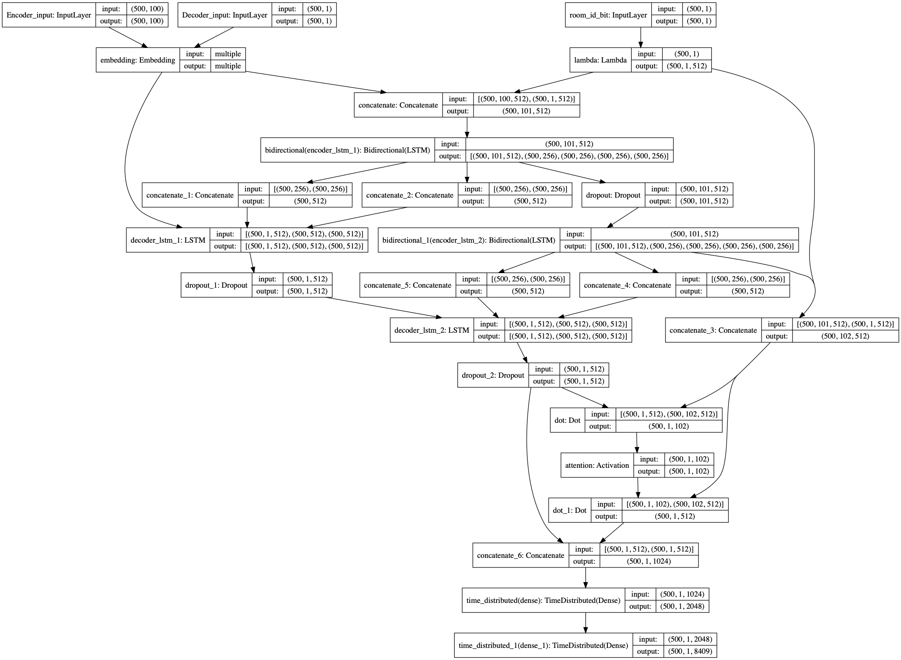

# Artificial_dd

### [](https://shields.io/)
Please keep this repo **private**, and please notice that this is **not** an open-source software currently. 

### [](https://shields.io/)
A software that can send context-based fake danmaku
Please write more things here if any of you want to describe this project...

### [](https://shields.io/)
This is a sequence-to-sequence model with attention mechanism. The encoder is used to compress the information in input messages, and the decoder is responsible for generating new texts based on the inputs. Here is the model structure:

<p>
    
</p>

### [](https://shields.io/)
1. Run the following command, and you should see two folders named 'content' and 'tmp'.
```
bash ./download_sources.sh
```
2. Run the following command, and you should see the outputs.
```
python3 model_process.py
```

### [](https://shields.io/)

With inputs:
```
？？？
要让老师小心一点
太可爱了
前面的泥垢了
没有超美丽3d，白等了
？没见过这种包法呀
awsl
来了来了
封面为什么这么骚
同问
2333
三次元的朋友也不能放弃啊
awsl
awsl
awsl
```
Here are the outputs:
```
阿伟出来受死！
wwwww
wwwwwwwwwwwwwwwwwwwwww
可爱
awsl
awsl
awsl
草
awsl
awsl
爱酱好可爱
awsl
阿伟出来受死
awsl
awsl
awsl
114514
你不要过来啊
阿伟死了
```
